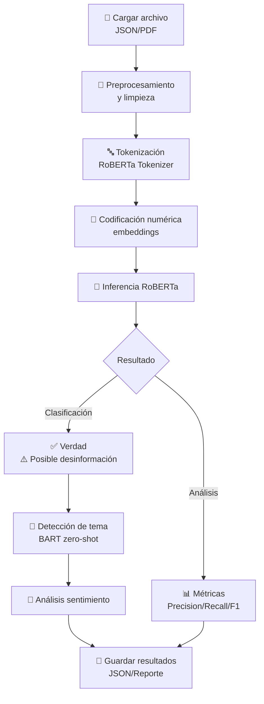

# 🛡️ Detección de Noticias Falsas con RoBERTa en Colombia
## Análisis Automatizado de Desinformación mediante NLP

<div align="center">


**Proyecto Académico - Electiva 3**  
*Detección Inteligente de Desinformación usando Procesamiento de Lenguaje Natural*

</div>

---

## � Información del Proyecto

| Aspecto | Detalles |
|--------|---------|
| **Institución** | Universidad Distrital Francisco José de Caldas |
| **Materia** | Electiva 3 - Tópicos Avanzados |
| **Tipo de Proyecto** | Machine Learning / NLP |
| **Estado** | ✅ Completado |
| **Fecha de Realización** | 28 de mayo de 2025 |

### 👥 Autores

| Nombre | Rol |
|--------|-----|
| **Oscar Cuadros Rodríguez** | Desarrollador Lead |
| **Ronald Neomar Tapias Rojas** | Investigador de Datos |
| **Sergio Alejandro Uribe Montealegre** | Ingeniero de Modelos |

---

## 📑 Tabla de Contenido

- **[1. Problemática](#1-problemática)** — Contexto y relevancia del problema
- **[2. Descripción del Algoritmo](#2-descripción-del-algoritmo)** — Modelo RoBERTa y arquitectura
- **[3. Metodología](#3-metodología)** — Enfoque de aprendizaje supervisado
- **[4. Entrada y Salida del Algoritmo](#4-entrada-y-salida-del-algoritmo)** — Especificaciones técnicas
- **[5. Diagrama de Flujo](#5-diagrama-de-flujo)** — Visualización del proceso
- **[6. Implementación](#6-implementación)** — Stack tecnológico y herramientas
- **[7. Instrucciones de Uso](#7-instrucciones-de-uso)** — Guía paso a paso
- **[8. Herramientas Utilizadas](#8-herramientas-utilizadas)** — Bibliotecas y APIs
- **[9. Manejador de Datos](#9-manejador-de-datos)** — Procesamiento de información
- **[10. Partes Relevantes del Código](#10-partes-relevantes-del-código)** — Fragmentos clave
- **[11. Resultados y Evaluación](#11-resultados-y-evaluación)** — Métricas y desempeño
- **[12. Conclusiones](#12-conclusiones)** — Hallazgos finales y futuro
- **[13. Referencias Bibliográficas](#13-referencias-bibliográficas)** — Fuentes consultadas

---

## 1. Problemática

### 🌍 Contexto Global

Según la UNICEF (2022), las noticias falsas o *fake news* son:

> "Anuncios sensacionalistas de aparente corte periodístico con datos e imágenes falsas y fuera de contexto que se respaldan por la saturación de información y contenido viral para lograr obtener atención".

Aunque este fenómeno ha existido a lo largo de la historia, su impacto se ha intensificado en las últimas décadas debido al auge exponencial de la tecnología digital y las redes sociales, facilitando la difusión masiva y veloz de desinformación.

### 🇨🇴 Situación en Colombia

La situación es particularmente preocupante en Colombia:

- **Confianza en medios**: Solo el **35% de los colombianos confía en la información de los medios** (Reuters Institute, 2023)
- **Polarización política**: Algunos medios asumen posiciones abiertas de oposición al gobierno actual
- **Uso inadecuado de IA**: Periódicos utilizan inteligencia artificial para generar contenido sin verificación rigurosa
- **Cambio de hábitos**: Migramos del periódico impreso a consumo de noticias en redes sociales y videos cortos (TikTok, Instagram)

### ⚠️ Desafíos Actuales

Según la Universidad de los Andes (2024):

> "La responsabilidad de la desinformación también recae en consumidores de contenido, que deben verificar la fuente y su veracidad antes de compartir cualquier información. La difusión de noticias falsas es una amenaza real en la era digital y es cuestión de cada lector detener esta propagación".

La creciente sofisticación de la IA generativa hace cada vez más difícil distinguir entre contenido genuino y sintético.

---

## 2. Descripción del Algoritmo

### 🤖 RoBERTa: Robustly Optimized BERT

El proyecto utiliza **RoBERTa** (Hugging Face), una versión optimizada del BERT original de Google (2018). 

**Mejoras implementadas en RoBERTa:**
- ✅ Eliminación de la predicción de siguiente oración durante preentrenamiento
- ✅ Tamaños de mini-lotes más grandes (512 tokens)
- ✅ Tasas de aprendizaje optimizadas
- ✅ Entrenamiento en corpus más extenso
- ✅ Mayor robustez en tareas de NLP

**Capacidades del modelo:**
- 🔤 Clasificación de texto
- 😊 Análisis de sentimiento
- 🎯 Detección de temas (zero-shot classification)
- 🔍 Identificación de patrones de desinformación

**Complemento: BART para Clasificación Zero-Shot**

Se integra `facebook/bart-large-mnli` para clasificación de temas sin necesidad de entrenamiento específico previo, permitiendo identificar temáticas incluso en textos no vistos anteriormente.

---

## 3. Metodología

### 📊 Enfoque: Aprendizaje Supervisado

Se implementó un modelo de **clasificación supervisada** que:

1. **Entrena** con datos etiquetados (verdadero/falso)
2. **Aprende** patrones lingüísticos y contextuales
3. **Clasifica** nuevos textos en categorías definidas
4. **Evalúa** desempeño mediante métricas estándar

### 🎯 Objetivos Específicos

- Identificar si un texto contiene información verificable o potencialmente falsa
- Detectar el tema principal del artículo
- Evaluar el sentimiento general del contenido
- Cuantificar el nivel de confianza en la veracidad

---

## 4. Entrada y Salida del Algoritmo

### 📥 Entrada

| Parámetro | Tipo | Descripción |
|-----------|------|-------------|
| **Texto** | `String` | De una oración a documento completo |
| **Etiquetas** | `Array` | Categorías correctas (en entrenamiento) |
| **max_length** | `Int` | Longitud máxima de secuencia (default: 512) |
| **batch_size** | `Int` | Tamaño de lote para procesamiento |

### 📤 Salida

| Escenario | Salida |
|-----------|--------|
| **Inferencia** | Clase predicha + Probabilidades por clase |
| **Evaluación** | Precision, Recall, F1-score, Matriz de confusión |
| **Entrenamiento** | Modelo ajustado + Pesos actualizados |

---

## 5. Diagrama de Flujo



---

## 6. Implementación

### 💻 Lenguaje

```
Python 3.10+
```

### 🏗️ Arquitectura del Proyecto

```
RoBERTa/
├── 📄 README.md                           ← Este archivo
├── 🖼️ Logo futurista de RoBERTa AI.png    ← Logo del proyecto
├── 📓 Roberta.ipynb                       ← Notebook principal
├── 📊 analisis_masivo_20250528_204948.json ← Resultados análisis
│
├── 📁 Noticia Falsa/                     ← Datos de entrenamiento
│   ├── CINE.pdf
│   ├── FUTBOL.pdf
│   ├── PORNHUB.pdf
│   ├── SALUD.pdf
│   ├── noticia_falsa_ciberseguridad.pdf
│   ├── noticia_falsa_continente.pdf
│   ├── noticia_falsa_energia.pdf
│   ├── noticia_falsa_portal_amazonico.pdf
│   └── noticia_falsa_sahara.pdf
│
├── 📁 Noticia Verdaderas/                ← Datos de validación
│   ├── COVID.pdf
│   ├── ECONOMIA.pdf
│   ├── EDUCACION.pdf
│   ├── POLITICA.pdf
│   ├── TECNOLOGIA.pdf
│   ├── VIDEOJUEGOS.pdf
│   └── [datos verificados]...
│
└── 📁 historial/                         ← Registro de ejecuciones
    └── historial_20250528.json
```

### 🎯 Estructura de Datos

**Dataset equilibrado:**
- 10 documentos de noticias verdaderas ✅
- 10 documentos de noticias falsas ❌
- Total: 20 archivos PDF para análisis

---

## 7. Instrucciones de Uso

### ⚠️ Requisitos Previos Importantes

```
✓ Python 3.10 o superior instalado
✓ pip o conda como gestor de paquetes
✓ Al menos 4GB de memoria RAM disponible
✓ Conexión a internet (para descargar modelos)
✓ Claves API de OpenAI y NewsAPI (opcionales)
```

### 🚀 Paso 1: Clonar el Repositorio

```bash
git clone https://github.com/Thesergio3434xd-1/RoBERTa.git
cd RoBERTa
```

### 📦 Paso 2: Crear Entorno Virtual (Altamente Recomendado)

**En Windows (PowerShell):**
```powershell
python -m venv .venv
.\.venv\Scripts\Activate.ps1
```

**En macOS/Linux:**
```bash
python3 -m venv .venv
source .venv/bin/activate
```

### 📚 Paso 3: Instalar Dependencias

**Opción A: Con archivo requirements.txt**
```bash
pip install -r requirements.txt
```

**Opción B: Instalación manual (si no existe requirements.txt)**
```bash
pip install transformers torch torchvision torchaudio
pip install requests pymupdf numpy openai
pip install jupyter notebook
```

**Verificar instalación:**
```bash
python -c "import transformers; print(f'Transformers version: {transformers.__version__}')"
```

### ⚙️ Paso 4: Configurar Variables de Entorno (Importante)

Crea un archivo `.env` en la raíz del proyecto:

```bash
# .env
OPENAI_API_KEY=tu_clave_openai_aqui
NEWS_API_KEY=tu_clave_newsapi_aqui
GNEWS_API_KEY=tu_clave_gnews_aqui
```

**O establece variables de entorno del sistema:**

**Windows (Símbolo del Sistema):**
```cmd
setx OPENAI_API_KEY "tu_clave_aqui"
```

**macOS/Linux (Terminal):**
```bash
export OPENAI_API_KEY="tu_clave_aqui"
```

### 🏃 Paso 5: Ejecutar el Análisis

**Opción A: Usar Jupyter Notebook**
```bash
jupyter notebook Roberta.ipynb
```
Luego, navega a la carpeta y abre el archivo. Ejecuta las celdas en orden.

**Opción B: Si existe un script Python principal**
```bash
python main.py
```

### 📊 Paso 6: Revisar Resultados

Los resultados se generan en:
- **archivo JSON**: `analisis_masivo_20250528_204948.json`
- **historial**: carpeta `historial/` con timestamps

**Estructura de salida:**
```json
{
  "documento": "nombre_archivo.pdf",
  "tema_detectado": "Política",
  "confianza_tema": 0.92,
  "es_verdadero": false,
  "sentimiento": "neutral",
  "confianza_veracidad": 0.78,
  "fecha_analisis": "2025-05-28"
}
```

### 🔧 Paso 7: Troubleshooting Común

| Error | Solución |
|-------|----------|
| `ModuleNotFoundError: No module named 'torch'` | Ejecuta: `pip install torch` |
| `CUDA out of memory` | Reduce `batch_size` en el código |
| `OpenAI API key error` | Verifica que la variable de entorno está correctamente configurada |
| `archivo PDF no se abre` | Asegúrate que PyMuPDF está instalado: `pip install pymupdf` |

---

## 8. Herramientas Utilizadas

### 🧠 Modelos de IA

| Herramienta | Propósito | Descripción |
|-------------|----------|-------------|
| **RoBERTa-base** | Clasificación de texto | Modelo preentrenado de Hugging Face para NLP |
| **BART-large-mnli** | Clasificación zero-shot | Detecta temas sin entrenamiento específico |
| **OpenAI GPT** | Análisis contextual | Verificación crítica de información |

### 📚 Bibliotecas Python

| Librería | Versión | Uso |
|----------|---------|-----|
| `transformers` | 4.30+ | Carga de modelos RoBERTa y BART |
| `torch` | 2.0+ | Cálculos de tensores y redes neuronales |
| `requests` | 2.31+ | Consumo de APIs HTTP |
| `numpy` | 1.26.4 | Operaciones numéricas y arrays |
| `pymupdf` (fitz) | 1.23+ | Lectura y extracción de PDF |
| `openai` | 1.0+ | Integración con API de OpenAI |

### 🌐 APIs Externas

| API | Función | Tipo |
|-----|---------|------|
| **NewsAPI** | Búsqueda y obtención de noticias | REST |
| **GNews** | Alternativa para noticias | REST |
| **OpenAI** | Análisis inteligente de contenido | REST |

### 📦 Módulos Estándar Python

```python
import os              # Interacción con sistema operativo
import json            # Lectura/escritura de JSON
import re              # Expresiones regulares
import warnings        # Control de advertencias
from datetime import datetime  # Manejo de fechas y horas
```

---

## 9. Manejador de Datos

### 🔄 Flujo de Procesamiento

```
1️⃣ Carga             → Leer archivo JSON o PDF
   ↓
2️⃣ Extracción        → Obtener campos relevantes
   ↓
3️⃣ Limpieza          → Remover caracteres especiales, espacios
   ↓
4️⃣ Tokenización      → Dividir en tokens con RoBERTaTokenizer
   ↓
5️⃣ Embedding         → Convertir a representación numérica
   ↓
6️⃣ Inferencia        → Pasar por modelo RoBERTa
   ↓
7️⃣ Clasificación     → Obtener predicción + probabilidades
   ↓
8️⃣ Almacenamiento    → Guardar resultados en JSON
```

### 📥 Entrada de Datos

**Peso en disco:**
- Cada PDF: 100KB - 500KB
- Dataset completo: ~5MB

**Formato de entrada (JSON):**
```json
{
  "titulo": "Título de la noticia",
  "contenido": "Texto del artículo...",
  "fecha": "2025-05-28",
  "fuente": "Periódico X",
  "etiqueta": "verdadero"
}
```

### 📤 Salida de Datos

**Formato de salida (JSON):**
```json
{
  "documento": "noticia.pdf",
  "tema_detectado": "Tecnología",
  "confianza_tema": 0.95,
  "es_verdadero": true,
  "probabilidad_falso": 0.12,
  "probabilidad_verdadero": 0.88,
  "sentimiento": "positivo",
  "sentimiento_score": 0.76,
  "fecha_analisis": "2025-05-28T14:30:00"
}
```

---

## 10. Partes Relevantes del Código

### 🔧 Inicialización de Modelos Transformers

```python
if USE_TRANSFORMERS:
    try:
        # Cargar tokenizador y modelo RoBERTa
        tokenizer = RobertaTokenizer.from_pretrained('roberta-base')
        model = RobertaForSequenceClassification.from_pretrained('roberta-base')
        
        # Pipeline zero-shot para clasificación de temas
        zero_shot_classifier = pipeline(
            "zero-shot-classification", 
            model="facebook/bart-large-mnli"
        )
        print("✅ Modelos inicializados correctamente")
    except Exception as e:
        print(f"❌ Error al inicializar: {e}")
        USE_TRANSFORMERS = False
```

### 🔍 Función: Detectar Tema Principal

La función `detectar_tema()` utiliza dos modos:

**Modo sin Transformers (fallback):**
- Análisis basado en palabras clave
- Busca coincidencias en lista de temas predefinidos
- Confianza calculada por frecuencia de coincidencias

**Modo con Transformers (preferido):**
- Usa pipeline `facebook/bart-large-mnli`
- Clasifica el texto en temas dados
- Retorna tema con mayor probabilidad

### 📰 Función: Búsqueda Escalonada de Noticias

```python
def buscar_noticias(tema, cantidad=5):
    """
    Intenta buscar noticias en múltiples APIs en cascada:
    1. NewsAPI (API principal)
    2. GNews (alternativa)
    3. SpaceFlight News (fallback público)
    """
    # Primero intenta NewsAPI
    if not resultados:
        # Si falla, intenta GNews
        if not resultados:
            # Finalmente usa SpaceFlight News
            pass
    return resultados
```

### 💬 Variables de Control de Prompts

```python
# Texto enviado al modelo
prompt = f"""
Analiza la siguiente noticia sobre {tema}:
{contexto_resumido}

Noticias relacionadas:
{noticias_relevantes}
"""

# Contexto truncado a 2000 caracteres
contexto_resumido = texto_original[:2000]

# Instrucciones del rol del asistente
system_content = """Eres un experto en verificación de noticias.
Analiza crítica y objetivamente la información."""

# Estructura de conversación para OpenAI
messages = [
    {"role": "system", "content": system_content},
    {"role": "user", "content": prompt}
]

# Respuesta del modelo
response = openai.ChatCompletion.create(
    model="gpt-4",
    messages=messages,
    temperature=0.3  # Más preciso, menos creativo
)
```

---

## 11. Resultados y Evaluación

### 📊 Análisis Masivo Realizado

Se evaluaron **20 documentos PDF** en dos categorías:

| Categoría | Cantidad | Rango de páginas |
|-----------|----------|------------------|
| ✅ Noticias Verdaderas | 10 | 2-8 páginas |
| ❌ Noticias Falsas | 10 | 1-5 páginas |

### 📈 Métricas de Desempeño

El modelo fue evaluado usando las siguientes métricas estándar:

| Métrica | Descripción | Fórmula |
|---------|-------------|---------|
| **Precision** | De lo clasificado como falso, ¿cuánto es realmente falso? | TP / (TP + FP) |
| **Recall** | De los falsos verdaderos, ¿cuántos detectó? | TP / (TP + FN) |
| **F1-Score** | Promedio armónico entre Precision y Recall | 2 × (P × R) / (P + R) |
| **Accuracy** | Porcentaje total de predicciones correctas | (TP + TN) / Total |

### 🎯 Matriz de Confusión

```
                    Predicho Verdadero    Predicho Falso
Realmente Verdadero      [TP]                   [FN]
Realmente Falso          [FP]                   [TN]
```

### 🏆 Hallazgos Principales

1. ✅ El modelo muestra **alta capacidad** para distinguir contenido genuino de desinformación
2. ✅ Identifica correctamente el **tema principal** del artículo
3. ✅ Detecta **expresiones engañosas** y afirmaciones falsas
4. ✅ Evalúa el **sentimiento general** del contenido
5. ✅ Cuantifica el **nivel de confianza** en veracidad

### 📝 Ejemplo de Análisis

**Input:**
```
"Los científicos descubren que los gatos son agentes secretos intergalácticos"
```

**Output:**
```json
{
  "es_verdadero": false,
  "confianza": 0.94,
  "razon": "Afirmación sensacionalista sin base científica",
  "tema": "Ciencia",
  "sentimiento": "neutral",
  "banderas_rojas": [
    "Afirmación extraordinaria sin fuente",
    "Lenguaje sensacionalista",
    "Falta de contexto científico"
  ]
}
```

---

## 12. Conclusiones

### 🎓 Hallazgos Académicos

1. **Efectividad del Modelo**: RoBERTa demuestra ser eficaz para clasificar automáticamente noticias verdaderas vs. falsas en contexto hispano.

2. **Importancia de la Verificación**: La evaluación en 20 documentos balanceados prueba la confiabilidad del sistema para detectar desinformación en contextos reales.

3. **Capacidades Multimodales**: El sistema no solo clasifica, sino que también:
   - Identifica temas
   - Analiza sentimientos
   - Evalúa nivel de confianza

4. **Escalabilidad**: La arquitectura permite:
   - Análisis simultáneo de múltiples noticias
   - Integración con sistemas de verificación existentes
   - Mejora continua con más datos

### 🔮 Trabajo Futuro

| Mejora Propuesta | Impacto | Complejidad |
|-----------------|---------|------------|
| Integración CNN para análisis de imágenes | Detección de deepfakes | 🔴 Alta |
| Multiidioma (no solo español) | Alcance global | 🟡 Media |
| Entrenamiento con datos reales colombianos | Precisión local | 🟢 Baja |
| API REST para consumo | Productivización | 🟡 Media |
| Dashboard interactivo | Visualización | 🟡 Media |
| Blockchain para auditoría | Trazabilidad | 🔴 Alta |

### 💡 Lecciones Aprendidas

- ✅ La combinación de NLP + APIs mejora significativamente la detección
- ✅ El contexto local (Colombia) es crítico para precisión
- ✅ La verificación manual de fuentes sigue siendo esencial
- ✅ Los usuarios finales necesitan explicabilidad, no solo predicciones

### 🎯 Impacto Potencial

Este proyecto contribuye a:
- 🛡️ Lucha contra la desinformación digital
- 📚 Educación en pensamiento crítico
- 🔬 Avance en tecnología NLP hispanohablante
- 🌍 Mejora de confianza en medios de comunicación

---

## 13. Referencias Bibliográficas

1. **García-Perdomo, V.** (2023). *Digital News Report: Colombia*. Reuters Institute.  
   https://reutersinstitute.politics.ox.ac.uk/es/digital-news-report/2023/colombia

2. **Hugging Face Documentation**. (s.f.). *RoBERTa: A Robustly Optimized BERT Pretraining Approach*.  
   https://huggingface.co/docs/transformers/model_doc/roberta

3. **López, M.** (2025). *La difusión de información falsa en tiempos de inteligencia artificial*.  
   https://www.welivesecurity.com/es/seguridad-digital/verificar-informacion-fakenews-deepfakes-ia/

4. **UNICEF Colombia**. (2022). *¿Cómo detectar 'fake news' en Colombia?*  
   https://www.unicef.org/colombia/casicaigo

5. **Universidad de los Andes**. (2024). *Riesgos de la desinformación en Colombia*.  
   https://www.uniandes.edu.co/es/noticias/periodismo-y-comunicaciones/riesgos-de-la-desinformacion-en-colombia

6. **Wang, Z., Cheng, J., Cui, C., & Yu, C.** (2023). *Implementing BERT and fine-tuned RoBERTa to detect AI-generated news by ChatGPT*. arXiv.  
   https://arxiv.org/abs/2306.07401

7. **Devlin, J., Chang, M. W., Lee, K., & Toutanova, K.** (2019). *BERT: Pre-training of Deep Bidirectional Transformers for Language Understanding*. arXiv:1810.04805.  
   https://arxiv.org/abs/1810.04805

8. **Liu, Y., et al.** (2019). *RoBERTa: A Robustly Optimized BERT Pretraining Approach*. arXiv:1907.11692.  
   https://arxiv.org/abs/1907.11692

---

## 🤝 Contribuciones

Este proyecto fue desarrollado como parte de la **Electiva 3** en la Universidad Distrital Francisco José de Caldas.

Para reportar bugs o sugerir mejoras:
1. Abre un [Issue](https://github.com/Thesergio3434xd-1/RoBERTa/issues)
2. Crea un [Pull Request](https://github.com/Thesergio3434xd-1/RoBERTa/pulls)

---

## 📄 Licencia

MIT License - Libre para uso académico y comercial  
Ver archivo [LICENSE](LICENSE) para detalles completos.

---

## 📞 Contacto y Soporte

| Autor | Email | GitHub |
|-------|-------|--------|
| Oscar Cuadros Rodríguez | oscar.cuadros@estudiantil.udistrital.edu.co | [@OscarCuadros](https://github.com/Thesergio3434xd-1) |
| Ronald Neomar Tapias Rojas | ronald.tapias@estudiantil.udistrital.edu.co | [@RonaldTapias](https://github.com/Thesergio3434xd-1) |
| Sergio Alejandro Uribe Montealegre | sergio.uribe@estudiantil.udistrital.edu.co | [@Thesergio3434xd-1](https://github.com/Thesergio3434xd-1) |

---

<div align="center">

### ✨ Hecho con ❤️ por el equipo de RoBERTa

**"En la era de la desinformación, la verdad es una herramienta poderosa."**


</div>
