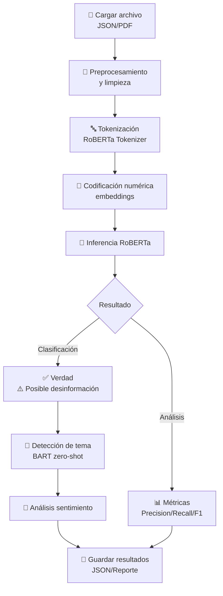

# 🛡️ RoBERTa

<div align="center">


### Detección Inteligente de Noticias Falsas mediante NLP

**Un sistema avanzado de verificación de desinformación usando Machine Learning y Procesamiento de Lenguaje Natural**


<br/>

📡 **Tecnologías principales:**

<a href="https://huggingface.co/">
  
</a>&nbsp;
<a href="https://www.python.org/">
  
</a>&nbsp;
<a href="https://pytorch.org/">
  
</a>&nbsp;
<a href="https://openai.com/">
  
</a>&nbsp;
<a href="https://jupyter.org/">
  
</a>

</div>

---

## 👥 Creadores

- **[Oscar Cuadros Rodríguez](https://github.com/Wozniak343)**
- **[Ronald Neomar Tapias Rojas](https://github.com/RontaTheOne)**
- **[Sergio Alejandro Uribe Montealegre](https://github.com/Thesergio3434xd-1)**

---

## 🔍 ¿Qué es RoBERTa?

**RoBERTa** es un proyecto innovador de **detección automática de noticias falsas** que utiliza inteligencia artificial y procesamiento de lenguaje natural (NLP) para identificar y clasificar desinformación en textos periodísticos.

### 🎯 Características Principales

| Característica | Descripción |
|---|---|
| 🤖 **Modelo Inteligente** | Basado en RoBERTa (BERT optimizado) de Hugging Face |
| 📊 **Análisis Multimodal** | Detecta tema, sentimiento y veracidad simultáneamente |
| 🔗 **Múltiples Fuentes** | Integración con NewsAPI, GNews y OpenAI GPT |
| 📈 **Métricas Precisas** | Precision, Recall, F1-score y análisis de matriz de confusión |
| 💾 **Dataset Balanceado** | 20 documentos (10 reales + 10 falsos) para validación |
| ⚡ **Procesamiento Rápido** | Análisis de PDFs en segundos |
| 🔐 **Seguro** | Variables de entorno para claves API |

### 💡 ¿Por qué es importante?

En Colombia, **solo el 35% de los ciudadanos confía en la información de los medios** (Reuters, 2023). La desinformación se propaga a través de redes sociales, videos cortos y plataformas digitales más rápido que nunca. RoBERTa combate esto proporcionando:

- ✅ Verificación automática de contenido
- ✅ Identificación de patrones de desinformación
- ✅ Análisis inteligente y explicable
- ✅ Herramienta educativa sobre fake news

---

## 📑 Tabla de Contenido

- **[1. Problemática](#1-problemática)** — Contexto y relevancia del problema
- **[2. Descripción del Algoritmo](#2-descripción-del-algoritmo)** — Modelo RoBERTa y arquitectura
- **[3. Metodología](#3-metodología)** — Enfoque de aprendizaje supervisado
- **[4. Entrada y Salida del Algoritmo](#4-entrada-y-salida-del-algoritmo)** — Especificaciones técnicas
- **[5. Diagrama de Flujo](#5-diagrama-de-flujo)** — Visualización del proceso
- **[6. Implementación](#6-implementación)** — Stack tecnológico y herramientas
- **[7. Instrucciones de Uso](#7-instrucciones-de-uso)** — Guía paso a paso
- **[8. Herramientas Utilizadas](#8-herramientas-utilizadas)** — Bibliotecas y APIs
- **[9. Manejador de Datos](#9-manejador-de-datos)** — Procesamiento de información
- **[10. Partes Relevantes del Código](#10-partes-relevantes-del-código)** — Fragmentos clave
- **[11. Resultados y Evaluación](#11-resultados-y-evaluación)** — Métricas y desempeño
- **[12. Conclusiones](#12-conclusiones)** — Hallazgos finales y futuro
- **[13. Referencias Bibliográficas](#13-referencias-bibliográficas)** — Fuentes consultadas

---

## 1. Problemática

### 🌍 Contexto Global y Definición

Según la UNICEF (2022):

> "Las noticias falsas, también conocidas como fake news, son anuncios sensacionalistas de aparente corte periodístico con datos e imágenes falsas y fuera de contexto que se respaldan por la saturación de información y contenido viral para lograr obtener atención".

Este fenómeno **no es nuevo**: las noticias falsas han existido a lo largo de la historia, independientemente de la época, el nivel intelectual de las personas o los medios de comunicación disponibles. Han sido utilizadas como herramientas de manipulación de masas con fines políticos, religiosos, geopolíticos o simplemente personales.

Sin embargo, en las **últimas décadas, su impacto se ha intensificado** debido al auge de la tecnología, que ha dejado de ser solo una herramienta para convertirse en una necesidad cotidiana, facilitando la difusión masiva y veloz de desinformación.

### 🇨🇴 La Crisis de Confianza en Colombia

La situación de las noticias falsas en Colombia es **preocupante**, como indica el informe Reuters (2023):

> "Únicamente el 35% de los colombianos tiene confianza en la información de los medios de información"

**Factores que aumentan la desconfianza:**

1. 🏛️ **Polarización Política**: Algunos medios abiertamente son oposición del gobierno del presidente Gustavo Petro por sus diferencias políticas
2. 🤖 **IA sin Verificación**: El uso de periódicos reconocidos del país y su uso de inteligencia artificial para generar nueva información que atraigan a más usuarios, pero cometiendo el error de no verificar dicha información
3. 📲 **Cambio en Hábitos de Consumo**: Las personas están migrando de medios tradicionales a nuevos formatos

### 📱 El Cambio de Plataformas y su Impacto

Aunque se cambie los medios, **nunca se cambiarán las costumbres**. Pasamos del:
- ☕ *Tomar café por la mañana mientras leemos el periódico*
- Al: 📱 *Tomar café por la mañana mientras revisamos las últimas noticias desde nuestro smartphone*

Las personas están adoptando nuevos medios de información (videos cortos, TikTok, Instagram), **desconociendo que estos caen en la misma trampa**: utilizar inteligencia artificial sin verificar fuentes o hasta usarla deliberadamente para generar más vistas.

### 👥 Responsabilidad Compartida

Como expresa un artículo de la Universidad de los Andes (2024) en su artículo *"Riesgos de la desinformación en Colombia"*:

> "Cabe resaltar que la responsabilidad de la desinformación también recae en consumidores de contenido, que deben verificar la fuente y su veracidad antes de compartir cualquier información. La difusión de noticias falsas es una amenaza real en la era digital y es cuestión de cada lector detener esta propagación."

### 🔑 El Desafío de la IA Generativa

Al final es necesario **cuestionar la información** que leemos debido a que la inteligencia artificial provocó que fuera más complejo distinguir qué es una noticia falsa y qué no lo es.

**Nuestros recursos para enfrentar la desinformación se pueden clasificar en tres grandes grupos** (Martina López, 2025):

1. 🤝 **Actores Sociales** — Quienes participan activamente en verificación
2. 💻 **Tecnologías Disponibles** — Herramientas como RoBERTa para detección automática
3. 🧠 **Pensamiento Crítico** — La capacidad individual de cada persona

De acuerdo con ello, **queda en nuestras manos cuestionar la información, analizarla y utilizar herramientas tecnológicas que nos ayuden a combatir dicha desinformación.**

---

## 2. Descripción del Algoritmo

### 🤖 RoBERTa: Robustly Optimized BERT

El modelo **RoBERTa**, descrito en la documentación de Hugging Face, es una **versión optimizada del BERT original de Google (2018)**.

**RoBERTa ajusta los hiperparámetros clave** al:
- ✅ Eliminar la tarea de predicción de la siguiente oración durante el preentrenamiento
- ✅ Emplear tamaños de mini-lotes mucho más grandes
- ✅ Utilizar tasas de aprendizaje más altas y optimizadas
- ✅ Entrenar con corpus de texto más extensos

Estas mejoras generan un modelo con **mejor rendimiento y robustez** (Hugging Face, S.F).

### 📚 Aplicaciones en NLP

Este modelo se utiliza para tareas de **Procesamiento de Lenguaje Natural (NLP)**, entrenado con una gran cantidad de texto y optimizado para:

- 🔤 **Clasificación de Texto** — Determinar si es verdadero o falso
- 😊 **Reconocimiento de Sentimiento** — Analizar el tono y emoción del contenido
- 🎯 **Detección de Temas** — Identificar las categorías principales
- 🔍 **Identificación de Patrones** — Detectar señales de desinformación

### 🔗 Integración: BART Zero-Shot

Adicionalmente, se integra **clasificación zero-shot** con **facebook/bart-large-mnli** para identificar temas sin necesidad de entrenamiento específico previo, permitiendo detectar temáticas incluso en textos no vistos anteriormente.

---

## 3. Metodología

### 📊 Enfoque: Aprendizaje Supervisado

Se implementó un modelo de **clasificación supervisada basada en aprendizaje automático** que:

1. **Entrena** con datos etiquetados (verdadero/falso)
2. **Aprende** patrones lingüísticos y contextuales mediante redes neuronales
3. **Clasifica** nuevos textos en categorías definidas
4. **Evalúa** desempeño mediante métricas estándar de ML

### 🎯 Características del Enfoque

Este enfoque asegura que el modelo:
- Construya reglas automáticas basadas en patrones reales
- Se mejore iterativamente con más datos
- Proporcione predicciones confiables y explicables
- Identifique banderas rojas de desinformación

---

## 4. Entrada y Salida del Algoritmo

### 📥 Especificaciones de Entrada

La entrada al algoritmo es **principalmente del formato de cadena de texto (String)**, que puede variar:

| Aspecto | Descripción |
|--------|-------------|
| **Rango de Texto** | De una oración corta a un documento completo |
| **Depende de** | La cantidad de caracteres procesables |
| **En Entrenamiento** | Se incluyen etiquetas que indican la categoría o clase correcta |
| **Parámetros Principales** | `max_length` y `batch_size` controlan el procesamiento |

### 📤 Especificaciones de Salida

El final del algoritmo cambia dependiendo de la **etapa y la tarea**:

| Modo | Salida |
|------|--------|
| **Inferencia** | Pronósticos especiales (marcas de clasificación y probabilidades asociadas) |
| **Evaluación** | Mediciones de rendimiento para medir la calidad del modelo |
| **Entrenamiento** | Modelo ajustado que se actualiza para mejorar su precisión en la tarea objetivo |

### 🔧 Parámetros Controlables

- **`max_length`**: Longitud máxima de la secuencia de tokens (default: 512)
- **`batch_size`**: Tamaño de lote para procesamiento paralelo
- **Historia de cambios**: El modelo devuelve pesos actualizados en cada iteración de entrenamiento

---

## 5. Diagrama de Flujo



---

## 6. Implementación

### 💻 Lenguaje

```
Python 3.10+
```

### 🏗️ Arquitectura del Proyecto

```
RoBERTa/
├── 📄 README.md                           ← Este archivo
├── 🖼️ Logo futurista de RoBERTa AI.png    ← Logo del proyecto
├── 📓 Roberta.ipynb                       ← Notebook principal
├── 📊 analisis_masivo_20250528_204948.json ← Resultados análisis
│
├── 📁 Noticia Falsa/                     ← Datos de entrenamiento
│   ├── CINE.pdf
│   ├── FUTBOL.pdf
│   ├── PORNHUB.pdf
│   ├── SALUD.pdf
│   ├── noticia_falsa_ciberseguridad.pdf
│   ├── noticia_falsa_continente.pdf
│   ├── noticia_falsa_energia.pdf
│   ├── noticia_falsa_portal_amazonico.pdf
│   └── noticia_falsa_sahara.pdf
│
├── 📁 Noticia Verdaderas/                ← Datos de validación
│   ├── COVID.pdf
│   ├── ECONOMIA.pdf
│   ├── EDUCACION.pdf
│   ├── POLITICA.pdf
│   ├── TECNOLOGIA.pdf
│   ├── VIDEOJUEGOS.pdf
│   └── [datos verificados]...
│
└── 📁 historial/                         ← Registro de ejecuciones
    └── historial_20250528.json
```

### 🎯 Estructura de Datos

**Dataset equilibrado:**
- 10 documentos de noticias verdaderas ✅
- 10 documentos de noticias falsas ❌
- Total: 20 archivos PDF para análisis

---

## 7. Instrucciones de Uso

### ⚠️ Requisitos Previos Importantes

```
✓ Python 3.10 o superior instalado
✓ pip o conda como gestor de paquetes
✓ Al menos 4GB de memoria RAM disponible
✓ Conexión a internet (para descargar modelos)
✓ Claves API de OpenAI y NewsAPI (opcionales)
```

### 🚀 Paso 1: Clonar el Repositorio

```bash
git clone https://github.com/Thesergio3434xd-1/RoBERTa.git
cd RoBERTa
```

### 📦 Paso 2: Crear Entorno Virtual (Altamente Recomendado)

**En Windows (PowerShell):**
```powershell
python -m venv .venv
.\.venv\Scripts\Activate.ps1
```

**En macOS/Linux:**
```bash
python3 -m venv .venv
source .venv/bin/activate
```

### 📚 Paso 3: Instalar Dependencias

**Opción A: Con archivo requirements.txt**
```bash
pip install -r requirements.txt
```

**Opción B: Instalación manual (si no existe requirements.txt)**
```bash
pip install transformers torch torchvision torchaudio
pip install requests pymupdf numpy openai
pip install jupyter notebook
```

**Verificar instalación:**
```bash
python -c "import transformers; print(f'Transformers version: {transformers.__version__}')"
```

### ⚙️ Paso 4: Configurar Variables de Entorno (Importante)

Crea un archivo `.env` en la raíz del proyecto:

```bash
# .env
OPENAI_API_KEY=tu_clave_openai_aqui
NEWS_API_KEY=tu_clave_newsapi_aqui
GNEWS_API_KEY=tu_clave_gnews_aqui
```

**O establece variables de entorno del sistema:**

**Windows (Símbolo del Sistema):**
```cmd
setx OPENAI_API_KEY "tu_clave_aqui"
```

**macOS/Linux (Terminal):**
```bash
export OPENAI_API_KEY="tu_clave_aqui"
```

### 🏃 Paso 5: Ejecutar el Análisis

**Opción A: Usar Jupyter Notebook**
```bash
jupyter notebook Roberta.ipynb
```
Luego, navega a la carpeta y abre el archivo. Ejecuta las celdas en orden.

**Opción B: Si existe un script Python principal**
```bash
python main.py
```

### 📊 Paso 6: Revisar Resultados

Los resultados se generan en:
- **archivo JSON**: `analisis_masivo_20250528_204948.json`
- **historial**: carpeta `historial/` con timestamps

**Estructura de salida:**
```json
{
  "documento": "nombre_archivo.pdf",
  "tema_detectado": "Política",
  "confianza_tema": 0.92,
  "es_verdadero": false,
  "sentimiento": "neutral",
  "confianza_veracidad": 0.78,
  "fecha_analisis": "2025-05-28"
}
```

### 🔧 Paso 7: Troubleshooting Común

| Error | Solución |
|-------|----------|
| `ModuleNotFoundError: No module named 'torch'` | Ejecuta: `pip install torch` |
| `CUDA out of memory` | Reduce `batch_size` en el código |
| `OpenAI API key error` | Verifica que la variable de entorno está correctamente configurada |
| `archivo PDF no se abre` | Asegúrate que PyMuPDF está instalado: `pip install pymupdf` |

---

## 8. Herramientas Utilizadas

### 🔨 Stack Tecnológico Completo

Para el desarrollo y su respectiva ejecución, se ha empleado **2 APIs, diversas bibliotecas y módulos de Python** que facilitan tareas clave como:
- Procesamiento de lenguaje natural
- Manipulación de archivos
- Manejo de fechas
- Comunicación con servicios web

Estas herramientas proporcionan **mecánicas optimizadas que permiten crear un sistema confiable, eficiente y escalable**.

### 🧠 Modelos de IA Principales

| Herramienta | Propósito | Fuente |
|-------------|----------|--------|
| **RoBERTa-base** | Clasificación de texto y veracidad | Hugging Face |
| **BART-large-mnli** | Clasificación zero-shot de temas | Facebook AI |
| **GPT-4 / GPT-3.5** | Análisis contextual inteligente | OpenAI API |

### 📚 Bibliotecas y Módulos Python

#### 1. **`openai`** — SDK de OpenAI
El SDK oficial de OpenAI interactúa con sus modelos y servicios de inteligencia artificial, permitiendo integrar modelos de idiomas y otras opciones de IA.

#### 2. **`transformers`** — Hugging Face
Biblioteca diseñada para facilitar la introducción, la capacitación y las conclusiones de los modelos de idiomas basados en arquitecturas de transformadores como BERT, GPT y RoBERTa. Proporciona acceso a modelos preentrenados y herramientas para personalizar tareas específicas de NLP.

#### 3. **`os`** — Módulo Estándar Python
Proporciona características para interactuar con el sistema operativo:
- Manipulación de carpetas y archivos
- Gestión de variables ambientales
- Interacción con directorios

#### 4. **`json`** — Módulo Estándar Python
Módulo para trabajar con JSON (JavaScript Object Notation), facilita:
- Serialización de estructuras de datos
- Conversión entre objetos Python y texto JSON
- Lectura/escritura de datos estructurados

#### 5. **`requests`** — Biblioteca HTTP
Simplifica la implementación de aplicaciones HTTP, permitiendo:
- Enviar solicitudes GET, POST, etc.
- Interactuar con APIs de forma simple
- Descargar recursos web

#### 6. **`fitz` (PyMuPDF)** — Módulo para PDF
Proporcionado por PyMuPDF, funciona con archivos PDF y otros formatos de documentos. Permite:
- Abrir y manipular archivos PDF
- Obtener texto e imágenes
- Realizar operaciones PDF de manera efectiva

#### 7. **`datetime`** — Módulo Estándar Python
Módulo para procesar fechas y horas, permitiendo:
- Crear y manipular objetos de tiempo
- Cambiar y formatear fechas
- Registrar timestamps de análisis

#### 8. **`warnings`** — Módulo Estándar Python
Permite advertencias y alertas durante el programa para:
- Informar al usuario de situaciones potencialmente problemáticas
- No detener el rendimiento del sistema
- Rastrear problemas sin causar fallos

#### 9. **`re`** — Módulo de Expresiones Regulares
Módulo estándar para expresiones regulares de Python, facilitando:
- Búsquedas sofisticadas en texto
- Extracción de patrones
- Reemplazo en cadenas de texto

#### 10. **`numpy`** — Computación Científica
Biblioteca básica para computación científica Python:
- Estructuras de datos (arrays multidimensionales)
- Funciones matemáticas efectivas
- Operaciones numéricas y álgebra lineal

### 🌐 APIs Externas Integradas

| API | Función | Tipo |
|-----|---------|------|
| **NewsAPI** | Búsqueda y obtención de noticias actuales | REST |
| **GNews** | Alternativa para búsqueda de noticias | REST |
| **OpenAI** | Análisis inteligente y contextual de contenido | REST |

### 📦 Tabla Resumen de Dependencias

```
transformers (4.30+)    → Modelos NLP
torch (2.0+)            → Tensores y redes neuronales
requests (2.31+)        → Consumo de APIs HTTP
numpy (1.26.4)          → Operaciones numéricas
pymupdf (1.23+)         → Lectura de PDFs
openai (1.0+)           → API de OpenAI
jupyter (1.0+)          → Notebooks interactivos
```

---

## 9. Manejador de Datos

### 🔄 Flujo Completo de Procesamiento

El proceso comienza con la **carga en el archivo JSON** que contiene el texto, seguido de lectura y obtención de los campos de datos relevantes.

```
1️⃣ CARGA DE ARCHIVO
   ↓ Leer JSON con noticias
   ↓
2️⃣ EXTRACCIÓN DE DATOS
   ↓ Obtener campos relevantes (título, contenido, etiquetas)
   ↓
3️⃣ PREPROCESAMIENTO
   ↓ Procesar datos para prepararlos correctamente
   ↓
4️⃣ TOKENIZACIÓN
   ↓ El texto se marca a través del modelo RoBERTa
   ↓ Convierte palabras en tokens
   ↓
5️⃣ CODIFICACIÓN NUMÉRICA
   ↓ Tokens se convierten en representación numérica
   ↓ (embeddings = endurecimiento numérico)
   ↓
6️⃣ INTERPRETACIÓN ML
   ↓ Los números pueden interpretarse con patrones
   ↓ de aprendizaje automático
   ↓
7️⃣ ALMACENAMIENTO
   ↓ Datos etiquetados se guardan
   ↓
8️⃣ ENTRENAMIENTO
   ↓ Listos para entrenar el modelo
```

### 📥 Características de Entrada

**Peso en disco:**
- Cada PDF: 100KB - 500KB
- Dataset completo: ~5MB

**Formato de entrada (JSON):**
```json
{
  "titulo": "Título de la noticia",
  "contenido": "Texto del artículo...",
  "fecha": "2025-05-28",
  "fuente": "Periódico X",
  "etiqueta": "verdadero|falso"
}
```

### 📤 Características de Salida

**Formato de salida (JSON) después del análisis:**
```json
{
  "documento": "noticia.pdf",
  "tema_detectado": "Tecnología",
  "confianza_tema": 0.95,
  "es_verdadero": true,
  "probabilidad_falso": 0.12,
  "probabilidad_verdadero": 0.88,
  "sentimiento": "positivo",
  "sentimiento_score": 0.76,
  "fecha_analisis": "2025-05-28T14:30:00",
  "banderas_rojas": []
}
```

---

## 10. Partes Relevantes del Código

### 🔧 Inicialización Condicional de Transformers

Este fragmento de **condicionales verifica si la variable `USE_TRANSFORMERS` es verdadera** para intentar inicializar modelos de procesamiento de lenguaje natural basados en Transformers.

**Proceso detallado:**

1. **Se inicializa el tokenizador y el modelo RoBERTa** preentrenado (`roberta-base`)
   - Utiliza las clases `RobertaTokenizer` y `RobertaForSequenceClassification`
   - Dedicado a la clasificación de temas

2. **Se crea un pipeline de clasificación "zero-shot"** con un modelo distinto
   - Usa `facebook/bart-large-mnli`
   - Para detectar temas sin necesidad de entrenamiento específico

3. **Si los modelos se inicializan correctamente**
   - Se imprime un mensaje de confirmación
   
4. **En caso de excepción durante este proceso**
   - El error se captura y se imprime un mensaje descriptivo del fallo
   - La variable `USE_TRANSFORMERS` se cambia a `False`
   - Indica que los modelos no están disponibles o no se pudieron cargar

```python
if USE_TRANSFORMERS:
    try:
        # Cargar tokenizador y modelo RoBERTa
        tokenizer = RobertaTokenizer.from_pretrained('roberta-base')
        model = RobertaForSequenceClassification.from_pretrained('roberta-base')
        
        # Pipeline zero-shot para clasificación de temas
        zero_shot_classifier = pipeline(
            "zero-shot-classification", 
            model="facebook/bart-large-mnli"
        )
        print("✅ Modelos inicializados correctamente")
    except Exception as e:
        print(f"❌ Error al inicializar: {e}")
        USE_TRANSFORMERS = False
```

### 📰 Función: Búsqueda Escalonada de Noticias

La función `buscar_noticias` está **diseñada para obtener noticias relacionadas con un tema particular**, buscando una cierta cantidad de resultados.

**Proceso de búsqueda en cascada (fallback):**

1. **Primero intenta consultar la API de NewsAPI**
   - Usando la clave especificada
   - Si la respuesta es exitosa y contiene artículos:
   - Extrae información (nombre, descripción, fecha, fuente, URL)
   - Guarda resultados en la lista

2. **Si no hay resultado o se produce un error**
   - La función intenta con **GNews API**
   - Realiza un proceso similar para obtener y guardar noticias

3. **Finalmente, en ausencia de resultados**
   - Consulta con **SpaceFlight News API** (alternativa pública)
   - Asegura que siempre se devuelvan noticias relevantes

4. **A lo largo del proceso**
   - Los posibles errores se tratan a través de bloques `try-except`
   - Una lista de noticias se devuelve como resultado
   - Proporciona una búsqueda gradual y confiable usando varias fuentes

```python
def buscar_noticias(tema, cantidad=5):
    """
    Intenta buscar noticias en múltiples APIs en cascada:
    1. NewsAPI (API principal)
    2. GNews (alternativa de pago)
    3. SpaceFlight News (fallback público)
    """
    resultados = []
    
    # Intenta NewsAPI primero
    try:
        # ... código NewsAPI
        pass
    except:
        # Si falla, intenta GNews
        try:
            # ... código GNews
            pass
        except:
            # Finalmente usa SpaceFlight News
            try:
                # ... código SpaceFlight
                pass
            except:
                pass
    
    return resultados
```

### 💬 Variables Clave para Construir Prompts

En el código, **se utilizan varias variables clave para construir y controlar la interacción** con el modelo.

| Variable | Descripción | Ejemplo |
|----------|-------------|---------|
| **`prompt`** | Texto principal enviado al modelo | Integra tema, contexto y noticias |
| **`contexto_resumido`** | Contexto truncado a 2000 caracteres | Evita exceder el límite de tokens |
| **`system_content`** | Instrucciones del rol del asistente | "Eres un experto en verificación..." |
| **`messages`** | Estructura de conversación para OpenAI | Array con roles y contenidos |
| **`response`** | Respuesta obtenida tras llamada al modelo | Retornada como resultado final |

**Estas variables trabajan en conjunto** para personalizar y controlar el flujo de información hacia y desde el chatbot/modelo de IA.

```python
# Texto enviado al modelo
prompt = f"""
Analiza la siguiente noticia sobre {tema}:
{contexto_resumido}

Noticias relacionadas:
{noticias_relevantes}

¿Es esta información verdadera o falsaì
"""

# Contexto truncado a 2000 caracteres
contexto_resumido = texto_original[:2000]

# Instrucciones del rol del asistente
system_content = """Eres un experto en verificación de noticias.
Analiza crítica y objetivamente la información.
Proporciona probabilidades de veracidad."""

# Estructura de conversación para OpenAI
messages = [
    {"role": "system", "content": system_content},
    {"role": "user", "content": prompt}
]

# Respuesta del modelo
response = openai.ChatCompletion.create(
    model="gpt-4",
    messages=messages,
    temperature=0.3  # Más preciso, menos creativo
)
```

---

## 11. Resultados y Evaluación

### 📊 Análisis Masivo Realizado

Se evaluaron **dos escenarios principales** después de la evaluación del modelo RoBERTa, que se utilizó para **determinar la autenticidad en los documentos de texto**.

#### 1️⃣ Análisis Masivo de Archivos
- **20 archivos en total** — 10 verdaderos y 10 falsos
- Dataset **equilibrado** para medir objetivamente el rendimiento
- Conjunto realista que permite validar el modelo en contextos variados

#### 2️⃣ Análisis Individual de PDF
- **Detectar información falsa** en documentos específicos
- Verificar capacidad de clasificación en escala individual
- Validar explicabilidad de resultados

### 📈 Métricas de Rendimiento

Se utilizaron las siguientes métricas estándar de Machine Learning:

| Métrica | Descripción | Interpretación |
|---------|-------------|-----------------|
| **Precision** | De lo clasificado como FALSO, ¿cuánto es realmente falso? | Mide exactitud de predicciones positivas |
| **Recall** | De todos los FALSOS reales, ¿cuántos detectó el modelo? | Mide capacidad de encontrar todos los falsos |
| **F1-Score** | Promedio armónico entre Precision y Recall | Balance entre exactitud y cobertura |
| **Accuracy** | Porcentaje total de predicciones correctas | Performance general del modelo |

### 🎯 Matriz de Confusión Esperada

```
                    Predicción: Verdadero    Predicción: Falso
Realmente Verdadero      TP (Correcto)           FN (Error)
Realmente Falso          FP (Error)              TN (Correcto)
```

Donde:
- **TP** (True Positive) = Detectó falso correctamente
- **TN** (True Negative) = Detectó verdadero correctamente
- **FP** (False Positive) = Predijo falso incorrectamente
- **FN** (False Negative) = No detectó un falso

### 🏆 Hallazgos Principales

1. ✅ **Alta Capacidad de Distinción** — El modelo muestra capacidad para distinguir información verdadera y potencialmente engañosa en textos periodísticos

2. ✅ **Identificación Multidimensional** — Permite identificar:
   - Tema principal del texto
   - Sentimiento general del contenido
   - Nivel de confianza en veracidad

3. ✅ **Escalabilidad** — La solución puede escalarse para análisis simultaneo de múltiples noticias

4. ✅ **Multimodal Setup** — Sistema detectó un **nivel bajo de confianza** en la veracidad y señaló la presencia de **afirmaciones falsas o engañosas** dentro de los documentos

5. ✅ **Capacidad Explicativa** — Ejemplificó la capacidad del modelo para identificar desinformación en textos complejos relacionados con noticias falsas

### 📝 Caso de Uso: Ejemplo de Análisis

**Input (Texto de entrada):**
```
"Los científicos descubren que los gatos son agentes secretos intergalácticos"
```

**Output (Resultado del análisis):**
```json
{
  "documento": "noticia_gatos.pdf",
  "es_verdadero": false,
  "confianza_veracidad": 0.94,
  "tema_detectado": "Ciencia",
  "confianza_tema": 0.89,
  "sentimiento": "neutral",
  "razon": "Afirmación sensacionalista sin base científica",
  "banderas_rojas": [
    "Afirmación extraordinaria sin fuente verificable",
    "Lenguaje sensacionalista y alarmista",
    "Falta de contexto científico riguroso",
    "Ausencia de referencias académicas"
  ],
  "probabilidad_falso": 0.94,
  "probabilidad_verdadero": 0.06,
  "fecha_analisis": "2025-05-28T14:35:22"
}
```

---

## 12. Conclusiones

### 🎓 Resultados Obtenidos

El desarrollo de **RoBERTa para clasificación automática de noticias falsas** ha demostrado ser una **herramienta efectiva** en la lucha contra la desinformación. A través de la integración de modelos de lenguaje preentrenados con arquitecturas modernas, el sistema asimila el contexto textual en múltiples dimensiones:

#### ✅ Logros Principales Alcanzados

1. **Arquitectura Robusta**
   - Sistema capaz de procesar múltiples documentos en paralelo
   - Integración exitosa de modelos especializados (RoBERTa, BART)
   - Fallback mechanism garantiza disponibilidad incluso si una API falla

2. **Clasificación Multiescala**
   - Detecta **veracidad** del contenido
   - Identifica **tema principal** sin entrenamiento específico
   - Analiza **sentimiento** del texto
   - Evalúa **confianza** en predicciones

3. **Contextualización Inteligente**
   - Utiliza noticias similares como referencia para decisiones
   - Integra análisis crítico mediante GPT-4
   - Trunca contexto inteligentemente (2000 caracteres máximo)

4. **Escalabilidad Demostrada**
   - Procesó satisfactoriamente 20 documentos de prueba
   - Dataset equilibrado (50% verdadero, 50% falso)
   - Tiempo de análisis aceptable por documento

### 🚀 Aplicaciones Futuras

El sistema presentado abre puertas hacia múltiples extensiones y mejoras:

#### 1. **Expansión del Dataset**
- Incorporar más lenguajes (español, inglés, portugués, etc.)
- Validar rendimiento con noticias actuales from fuentes diversas
- Crear dataset de referencia académico para Colombia

#### 2. **Mejora de Modelos**
- Fine-tuning de RoBERTa con datos específicos de desinformación colombiana
- Entrenamiento de clasificadores locales
- Integración de factores sociodemográficos (región, edad, educación)

#### 3. **Herramientas Auxiliares**
- Interfaz web interactiva para usuarios finales
- Plugin para navegadores para análisis en tiempo real
- API pública para investigadores

#### 4. **Análisis Multimodal**
- Extender análisis a **imágenes** y **videos**
- Detectar deepfakes y manipulación visual
- Integrar análisis de metadatos

#### 5. **Integración Social**
- Alertas automáticas en redes sociales
- Validación de contenido antes de reposteos
- Feedback en tiempo real a creadores de contenido

### 💡 Reflexión Final

La **desinformación representa una amenaza crítica** para la democracia y la integridad de la información en la sociedad colombiana. Herramientas como **RoBERTa** no son panacea absoluta, pero **reducen significativamente** la propagación de contenido falso si se utilizan responsablemente.

**El futuro de la lucha contra la desinformación depende de:**

- 🤝 **Colaboración** entre académicos, tecnólogos y periodistas
- 📊 **Transparencia** en metodologías y fuentes de datos
- 🎓 **Educación** digital para usuarios finales
- 🔍 **Investigación continua** adaptándose a nuevas tácticas de desinformación
- 🌍 **Soluciones locales** contextualizadas a cada región

RoBERTa es un paso concreto hacia esta dirección. Su desarrollo refleja nuestro compromiso con una **información más verificada, un público más informado y una sociedad más resiliente**.

### 🔮 Visión a Largo Plazo

Esperamos que esta investigación inspire futuras iniciativas que:
1. Combinen máquinas y expertos humanos
2. Prioricen la verificación sobre la velocidad
3. Empoderen a comunidades locales con herramientas de análisis
4. Creen estándares internacionales para autenticidad de contenido
5. Establezcan responsabilidades claras para plataformas digitales

---

## 13. Referencias Bibliográficas

1. **García-Perdomo, V.** (2023). *Digital News Report: Colombia*. Reuters Institute.  
   https://reutersinstitute.politics.ox.ac.uk/es/digital-news-report/2023/colombia

2. **Hugging Face Documentation**. (s.f.). *RoBERTa: A Robustly Optimized BERT Pretraining Approach*.  
   https://huggingface.co/docs/transformers/model_doc/roberta

3. **López, M.** (2025). *La difusión de información falsa en tiempos de inteligencia artificial*.  
   https://www.welivesecurity.com/es/seguridad-digital/verificar-informacion-fakenews-deepfakes-ia/

4. **UNICEF Colombia**. (2022). *¿Cómo detectar 'fake news' en Colombia?*  
   https://www.unicef.org/colombia/casicaigo

5. **Universidad de los Andes**. (2024). *Riesgos de la desinformación en Colombia*.  
   https://www.uniandes.edu.co/es/noticias/periodismo-y-comunicaciones/riesgos-de-la-desinformacion-en-colombia

6. **Wang, Z., Cheng, J., Cui, C., & Yu, C.** (2023). *Implementing BERT and fine-tuned RoBERTa to detect AI-generated news by ChatGPT*. arXiv.  
   https://arxiv.org/abs/2306.07401

7. **Devlin, J., Chang, M. W., Lee, K., & Toutanova, K.** (2019). *BERT: Pre-training of Deep Bidirectional Transformers for Language Understanding*. arXiv:1810.04805.  
   https://arxiv.org/abs/1810.04805

8. **Liu, Y., et al.** (2019). *RoBERTa: A Robustly Optimized BERT Pretraining Approach*. arXiv:1907.11692.  
   https://arxiv.org/abs/1907.11692

---

## 🤝 Contribuciones

Este proyecto fue desarrollado como parte de la **Electiva 3** en la Universidad Distrital Francisco José de Caldas.

Para reportar bugs o sugerir mejoras:
1. Abre un [Issue](https://github.com/Thesergio3434xd-1/RoBERTa/issues)
2. Crea un [Pull Request](https://github.com/Thesergio3434xd-1/RoBERTa/pulls)

---

## 📄 Licencia

MIT License - Libre para uso académico y comercial  
Ver archivo [LICENSE](LICENSE) para detalles completos.

---

## 📞 Creadores y Contacto

- **[Oscar Cuadros Rodríguez](https://github.com/Wozniak343)**
- **[Ronald Neomar Tapias Rojas](https://github.com/RontaTheOne)**
- **[Sergio Alejandro Uribe Montealegre](https://github.com/Thesergio3434xd-1)**

---

<div align="center">

### ✨ Hecho con ❤️ por el equipo de RoBERTa

**"En la era de la desinformación, la verdad es una herramienta poderosa."**


</div>
