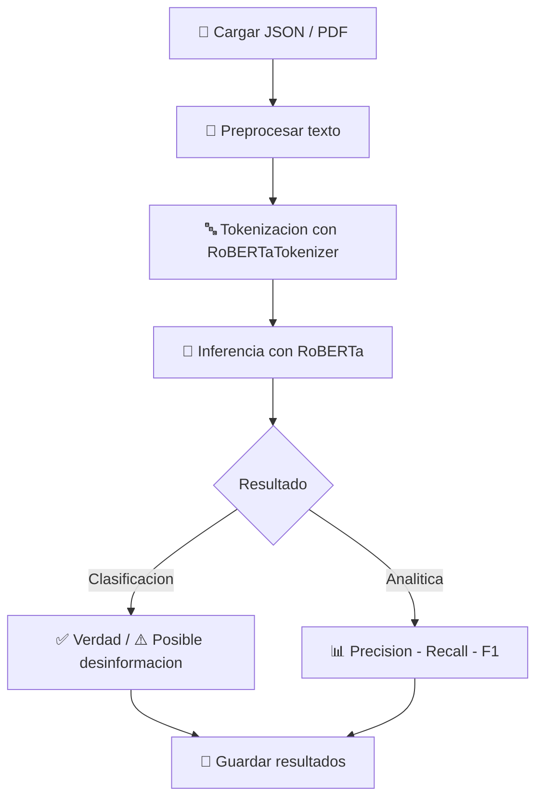

# 🛡️ Deteccion de Noticias Falsas con RoBERTa en Colombia

<p align="center">
   
</p>

<p align="center">
   
   
   
   
</p>


> Proyecto de analisis y clasificacion de noticias para detectar posible desinformacion usando procesamiento de lenguaje natural.

---

## 📌 Tabla de contenido

- [🌍 Problematica](#-problematica)
- [🤖 Descripcion del algoritmo](#-descripcion-del-algoritmo)
- [🧪 Metodologia](#-metodologia)
- [📥 Entrada y salida del algoritmo](#-entrada-y-salida-del-algoritmo)
- [🔁 Diagrama de flujo](#-diagrama-de-flujo)
- [⚙️ Implementacion](#️-implementacion)
- [🚀 Instrucciones de uso](#-instrucciones-de-uso)
- [🧰 Herramientas utilizadas](#-herramientas-utilizadas)
- [🖼️ Recursos visuales](#️-recursos-visuales)
- [🗂️ Manejador de datos](#️-manejador-de-datos)
- [🧩 Partes relevantes del codigo](#-partes-relevantes-del-codigo)
- [📊 Resultados y evaluacion](#-resultados-y-evaluacion)
- [✅ Conclusiones](#-conclusiones)
- [📚 Referencias bibliograficas](#-referencias-bibliograficas)

---

## 🌍 Problematica

Segun UNICEF (2022), las noticias falsas o *fake news* son contenidos sensacionalistas de aparente corte periodistico, construidos con datos e imagenes fuera de contexto para atraer atencion y viralizarse.

Aunque este fenomeno ha existido historicamente, en la actualidad su impacto es mayor por la velocidad de difusion en entornos digitales, redes sociales y plataformas de contenido corto.

En Colombia, la situacion es preocupante. De acuerdo con Reuters Institute (2023), solo el **35% de los colombianos confia en la informacion de los medios**. Entre los factores que aumentan esta desconfianza se encuentran:

- Polarizacion politica y sesgo mediatico.
- Publicacion de contenido sin verificacion rigurosa.
- Uso inadecuado de inteligencia artificial para generar informacion atractiva pero no necesariamente veridica.

El cambio en los habitos de consumo tambien influye: pasamos del periodico impreso a noticias en smartphone, videos cortos y redes, donde la desinformacion puede difundirse aun mas rapido.

Como resalta la Universidad de los Andes (2024), la responsabilidad no solo es de los emisores, sino tambien de quienes consumen y comparten informacion.

---

## 🤖 Descripcion del algoritmo

El proyecto utiliza **RoBERTa** (Hugging Face), una version optimizada de BERT, con mejoras en preentrenamiento e hiperparametros para tareas de NLP.

Este modelo permite:

- Clasificacion de texto.
- Analisis de sentimiento.
- Deteccion de patrones asociados a desinformacion.

Adicionalmente, se integra clasificacion *zero-shot* con **facebook/bart-large-mnli** para identificar temas sin entrenamiento especifico previo.

---

## 🧪 Metodologia

Se aplica un enfoque de **aprendizaje supervisado** para evaluar veracidad en noticias y documentos de texto.

---

## 📥 Entrada y salida del algoritmo

### Entrada

- Texto en formato cadena (*string*), desde una oracion corta hasta documentos mas largos.
- Etiquetas (en entrenamiento supervisado).
- Parametros de procesamiento como:
  - `max_length`
  - `batch_size`

### Salida

- Prediccion de clase (verdadera/falsa u otra categoria definida).
- Probabilidades asociadas por clase.
- Metricas de evaluacion en fase de prueba (precision, recall, F1, matriz de confusion).
- Modelo ajustado en fase de entrenamiento.

---

## 🔁 Diagrama de flujo



---

## ⚙️ Implementacion

- **Lenguaje:** Python
- **Enfoque:** NLP + APIs de noticias + clasificacion automatica

### Estructura base del proyecto

```text
analisis_masivo_20250528_204948.json
Roberta.ipynb
historial/
  historial_20250528.json
Noticia Falsa/
Noticia Verdaderas/
```

---

## 🚀 Instrucciones de uso

### 1) Clonar o abrir el proyecto

```bash
git clone <URL_DEL_REPOSITORIO>
cd "Electiva 3"
```

### 2) Crear entorno virtual (recomendado)

```bash
python -m venv .venv
```

En Windows PowerShell:

```powershell
.\.venv\Scripts\Activate.ps1
```

### 3) Instalar dependencias

Si tienes archivo `requirements.txt`:

```bash
pip install -r requirements.txt
```

Si no lo tienes aun, instala al menos:

```bash
pip install transformers torch requests pymupdf numpy openai
```

### 4) Ejecutar analisis

- Opcion A: abrir y ejecutar [Roberta.ipynb](Roberta.ipynb)
- Opcion B: ejecutar tu script principal si existe (por ejemplo `main.py`)

### 5) Revisar salidas

- Archivo de resultados: `analisis_masivo_20250528_204948.json`
- Historiales en carpeta: `historial/`

---

## 🖼️ Recursos visuales

### Logo del proyecto

<p align="center">
   
</p>

### Iconografia tecnica (internet)

<p align="center">
   
   
   
   
</p>

---

## 🧰 Herramientas utilizadas

Se emplearon 2 APIs y multiples bibliotecas de Python para procesamiento de lenguaje, manejo de datos y consumo de servicios web.

| Herramienta | Uso principal |
|---|---|
| `openai` | Integracion con modelos de IA mediante API |
| `transformers` | Carga/inferencia de modelos RoBERTa y BART |
| `os` | Interaccion con archivos y directorios |
| `json` | Lectura y escritura de datos estructurados |
| `requests` | Consumo de APIs HTTP |
| `fitz` (PyMuPDF) | Lectura y extraccion de texto en PDF |
| `datetime` | Manejo de fechas y tiempo |
| `warnings` | Control de advertencias en ejecucion |
| `re` | Procesamiento de texto con expresiones regulares |
| `numpy` | Operaciones numericas y soporte cientifico |

---

## 🗂️ Manejador de datos

Flujo general del manejo de datos:

1. Carga de archivos JSON con noticias.
2. Extraccion de campos relevantes.
3. Preprocesamiento del texto.
4. Tokenizacion con RoBERTa.
5. Conversion a representaciones numericas.
6. Almacenamiento de resultados etiquetados para entrenamiento/evaluacion.

---

## 🧩 Partes relevantes del codigo

### 1) Inicializacion condicional de Transformers

Se valida `USE_TRANSFORMERS` para intentar cargar:

- `RobertaTokenizer`
- `RobertaForSequenceClassification` (modelo `roberta-base`)
- Pipeline *zero-shot* con `facebook/bart-large-mnli`

Si ocurre un error:

- Se captura la excepcion.
- Se notifica el fallo.
- Se cambia `USE_TRANSFORMERS = False` para continuar sin bloqueo.

### 2) Funcion `buscar_noticias`

Realiza una busqueda escalonada de noticias por tema:

1. Consulta **NewsAPI**.
2. Si falla o no retorna articulos, intenta con **GNews**.
3. Si aun no hay resultados, usa **SpaceFlight News API** como alternativa publica.

Este enfoque mejora la robustez y reduce la dependencia de una sola fuente.

### 3) Variables clave para construir prompts

- `prompt`: Texto principal enviado al modelo.
- `contexto_resumido`: Contexto truncado (ej. 2000 caracteres) para evitar exceso de tokens.
- `system_content`: Instrucciones del rol del asistente (analisis experto y verificacion critica).
- `messages`: Estructura de conversacion para la API.
- `response`: Respuesta final retornada por el modelo.

---

## 📊 Resultados y evaluacion

Se evaluaron dos escenarios principales:

- **Analisis masivo** de 20 archivos (10 verdaderos y 10 falsos).
- **Analisis de PDF** para detectar contenido potencialmente falso.

Se utilizaron metricas como:

- Precision
- Recall
- F1-score
- Matriz de confusion

---

## ✅ Conclusiones

- El modelo muestra capacidad para distinguir informacion verdadera y potencialmente enganosa en textos periodisticos.
- Tambien permite identificar tema principal, sentimiento general y nivel de confianza en veracidad.
- La solucion puede escalarse para analisis simultaneo de multiples noticias.
- Como trabajo futuro, se podria integrar con modelos de vision (por ejemplo CNN) para detectar imagenes generadas por IA y complementar la verificacion multimodal.

---

## 📚 Referencias bibliograficas

1. Garcia-Perdomo, V. (2023). *Digital News Report: Colombia*. Reuters Institute.  
   https://reutersinstitute.politics.ox.ac.uk/es/digital-news-report/2023/colombia
2. Hugging Face. (s.f.). *RoBERTa documentation*.  
   https://huggingface.co/docs/transformers/model_doc/roberta
3. Lopez, M. (2025). *La difusion de informacion falsa en tiempos de inteligencia artificial*.  
   https://www.welivesecurity.com/es/seguridad-digital/verificar-informacion-fakenews-deepfakes-ia/
4. UNICEF. (2022). *¿Como detectar fake news en Colombia?*  
   https://www.unicef.org/colombia/casicaigo
5. Universidad de los Andes. (2024). *Riesgos de la desinformacion en Colombia*.  
   https://www.uniandes.edu.co/es/noticias/periodismo-y-comunicaciones/riesgos-de-la-desinformacion-en-colombia
6. Wang, Z., Cheng, J., Cui, C., & Yu, C. (2023). *Implementing BERT and fine-tuned RoBERTa to detect AI-generated news by ChatGPT*. arXiv.  
   https://arxiv.org/abs/2306.07401

---

## ✨ Nota final

Este proyecto combina tecnicas de NLP, pensamiento critico y verificacion de fuentes para contribuir a la lucha contra la desinformacion digital en Colombia.
